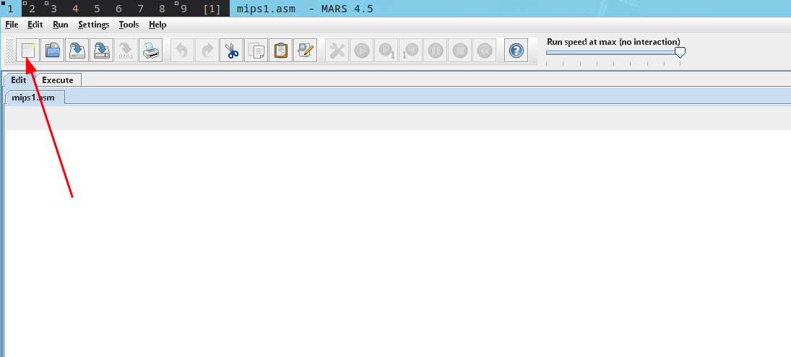

# TP Archi 2

## Steps to solve the TP

1. create a new file and save it using ctrl+s



2. copy the code from example 1 in the pdf

```bash
.data
vars:   .word 5
     .text
li $t0, 10
li $t1, 15
la $t2, vars
sw $t1, 0($t0)
lw $t2, 4($t0)
addi $t2, $t0,4
subi $t2, $t0,4
syscall
```

3. Donner le code  binaire de chaque instruction et le groupe de format.

